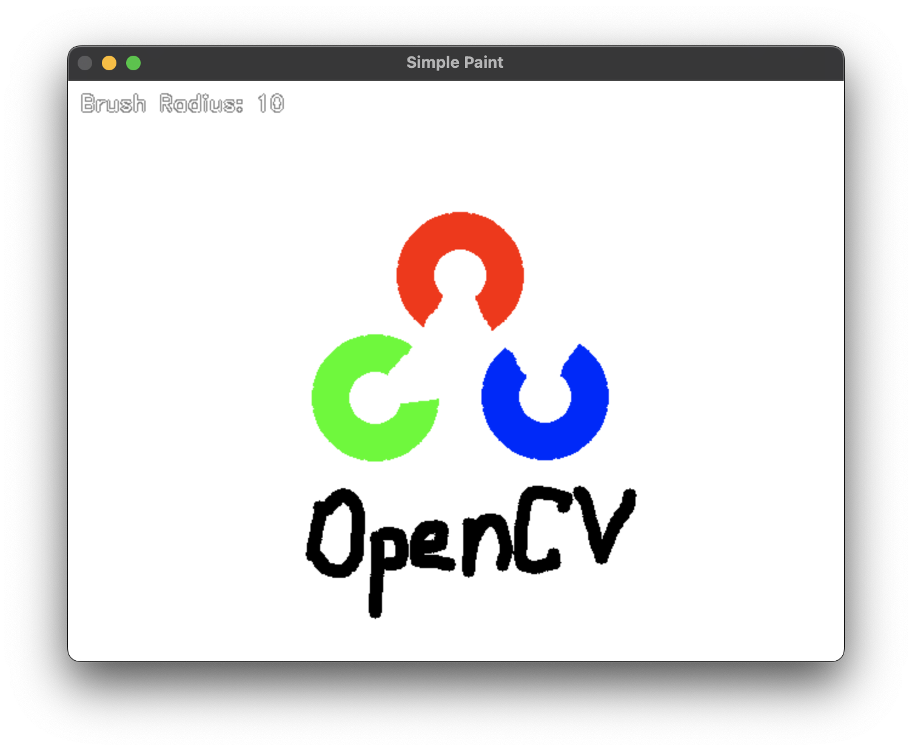
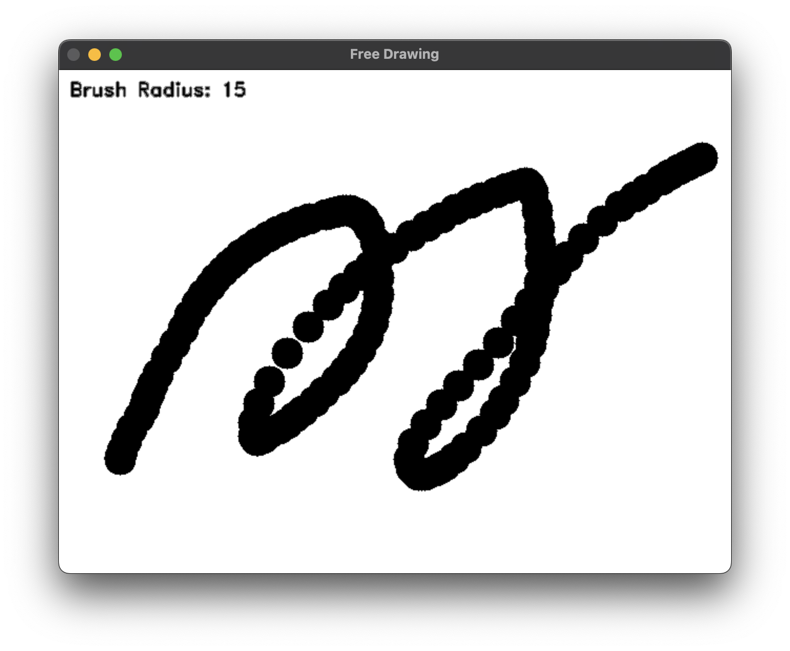
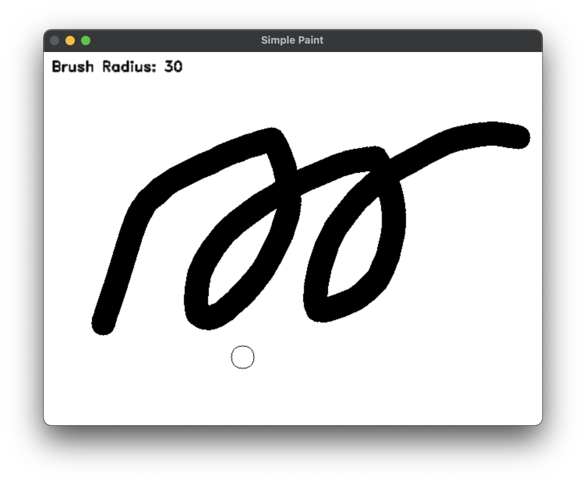
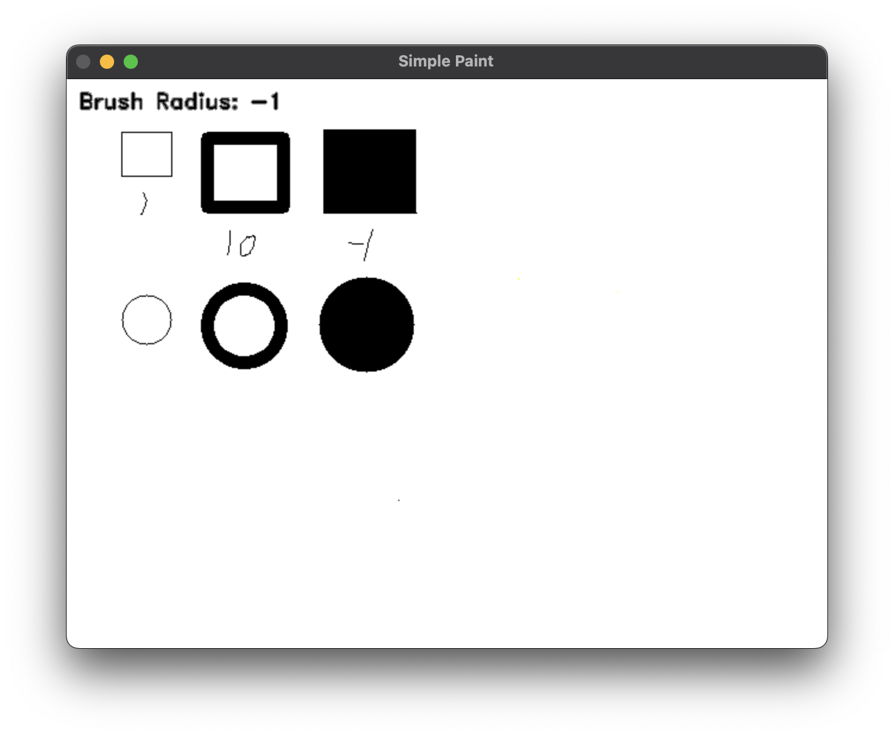

# Simple Paint

This project is a simple paint program using OpenCV, written in Python3.

This project enhanced some features from [free_drawing.py](https://github.com/mint-lab/cv_tutorial/blob/master/free_drawing.py) ([mint-lab/cv_tutorial](https://github.com/mint-lab/cv_tutorial))

## Features

### Smoother brush

Smoother brush when drawing a continuous line than original.

### Clear Screen

Clear screen with `X` key.

### Visible Brush Cursor

Visible brush cursor to obtain proper brush size.

### Draw Shapes

- `R` Key to draw rectangle.
- `C` Key to draw circle.

## How to Use

- Click to draw line.
- `R` key to draw rectangle.
- `C` key to draw circle.  
- `Tab` key to change color.
- `+`, `-` key to change brush radius.
- `X` key to clear screen.